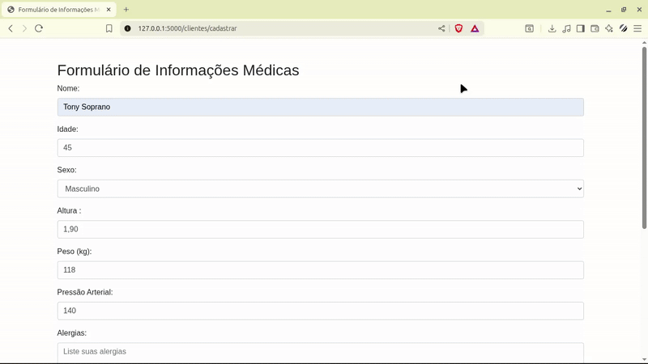

# Projeto Planejamento Informatica 💻 (Em desenvolvimento ⚠️)

Antes de rodar o código, você precisa ter o **Python 3** instalado em sua máquina. Você pode instalá-lo no [site oficial do Python](https://www.python.org/downloads/).

## 📌 Índice

- [Tecnologias Utilizadas](#tecnologias-utilizadas)
- [Funcionalidades Implementadas](#funcionalidades-implementadas)
- [Pré-requisitos](#pre-requisitos)
- [Execução](#execução)
- [Diagramas](#diagramas)
- [Imagens](#imagens-projeto)
- [Licença](#-licença)


## <a id="tecnologias-utilizadas"></a> 🛠️ Tecnologias Utilizadas

## <a id="funcionalidades-implementadas"></a> 🎯 Funcionalidades Implementadas

## <a id="pre-requisitos"></a> ⚙️ Pré-requisitos

## <a id="execução"></a> ▶️Execução

## <a id="diagramas"></a> 📊 Diagramas

## <a id="imagens-projeto"></a> 📷 Imagens do Projeto




### Install 🔧
```
pip install -r requirements.txt
```

### Run ⚡


```
python main.py
```
